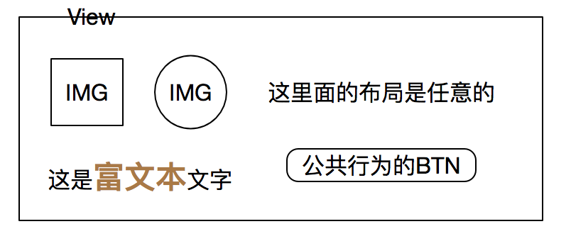
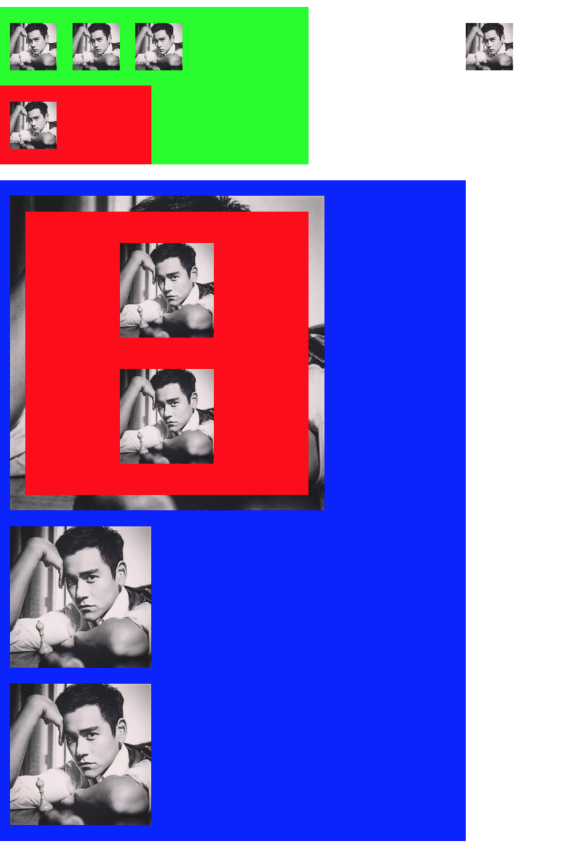
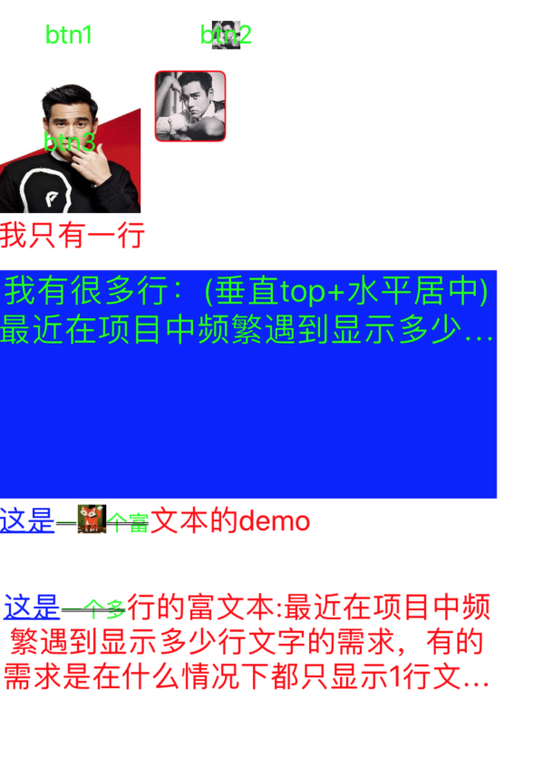

## iOS json解析生成view
> iOS中通过代码生成view，不过是通过调用set方法对相关属性进行配置，由此可以考虑通过后台传递相关数据进行解析。
>>> 设计思路同RN、Weex原理类似，前者通过js进行解析生成配置，我们这里通过对json解析进行配置，尽管这种方式操作复杂，但是相对于前者性能更高优（主要是不经过js线程~~！）。

目前网上已有类似的实现工具--[基于Json的页面动态化方案](https://blog.csdn.net/lizitao/article/details/74860322)  
以及[用JSON 实现iOS UI 实现原理说明](https://www.jianshu.com/p/ce80aa019d75)


### 目标功能
##### 可以实现在某个画布（view）上进行任意的生成特定ui样式


### 实现原理
##### string-》类型配置
很多属性都是非string类型，那么为了实现支持string转到配置，需要我们写出相关方法，博主采用的是继承的方案

```
@interface RuntimeLabel : UILabel
@property (nonatomic,copy) NSString *alignment_string;
@property (nonatomic,copy) NSString *font_color_string;
@property (nonatomic,copy) NSString *font_size_string;
@property (nonatomic,copy) NSString *line_breakmode_string;
@end
```
##### 利用runtime方法解析
相信大家都不愿意每个方法都去走switch或者if然后进行方法分发，由此引出runtime去调用set方法即可

```
        NSString *setterName = v_key;
        NSString *firstLetter = [NSString stringWithFormat:@"%c", [setterName characterAtIndex:0]];
        setterName = [setterName substringFromIndex:1];
        setterName = [NSString stringWithFormat:@"%@%@", firstLetter.uppercaseString, setterName];
        setterName = [NSString stringWithFormat:@"set%@:", setterName];
        SEL setter = NSSelectorFromString(setterName);
        if ([subView respondsToSelector:setter]) {
            ((void (*)(id, SEL, id))objc_msgSend)(subView, setter,  [viewDict objectForKey:v_key]);
        }
```

##### 专门解析view的类
有了上述准备接下来就是对json文件的解析了，json文件是是对布局信息与view相关信息的描述

```
data_layoutArray json:[
  {
    "layout_style" : "horizontal_layout",
    "frame_string" : "{{0,70},{200,100}}",
    "bgcolor_hex_string" : "#00FF00",
    "layout_views" : [
      {
        "layout_margin" : "{10,10}",
        "layout_width_height" : "{30,30}",
        "image_url" : "https:\/\/ss3.bdstatic.com\/70cFv8Sh_Q1YnxGkpoWK1HF6hhy\/it\/u=2515044163,2570565162&fm=27&gp=0.jpg",
        "view_class" : "RuntimeUIImageView"
      },
      {
        "image_url" : "https:\/\/ss3.bdstatic.com\/70cFv8Sh_Q1YnxGkpoWK1HF6hhy\/it\/u=2515044163,2570565162&fm=27&gp=0.jpg",
        "frame_string" : "{{50,10},{30,30}}",
        "view_class" : "RuntimeUIImageView"
      },
      {
        "layout_margin" : "{10,10}",
        "layout_width_height" : "{30,30}",
        "image_url" : "https:\/\/ss3.bdstatic.com\/70cFv8Sh_Q1YnxGkpoWK1HF6hhy\/it\/u=2515044163,2570565162&fm=27&gp=0.jpg",
        "view_class" : "RuntimeUIImageView"
      },
      {
        "layout_style" : "horizontal_layout",
        "frame_string" : "{{0,50},{100,50}}",
        "bgcolor_hex_string" : "#FF0000",
        "layout_views" : [
          {
            "layout_margin" : "{10,10}",
            "layout_width_height" : "{30,30}",
            "image_url" : "https:\/\/ss3.bdstatic.com\/70cFv8Sh_Q1YnxGkpoWK1HF6hhy\/it\/u=2515044163,2570565162&fm=27&gp=0.jpg",
            "view_class" : "RuntimeUIImageView"
          }
        ]
      }
    ]
  },
  {
    "layout_style" : "vertical_layout",
    "frame_string" : "{{0,180},{300,420}}",
    "bgcolor_hex_string" : "#0000FF",
    "layout_views" : [
      {
        "layout_margin" : "{10,10}",
        "layout_width_height" : "{200,200}",
        "image_url" : "https:\/\/ss3.bdstatic.com\/70cFv8Sh_Q1YnxGkpoWK1HF6hhy\/it\/u=2515044163,2570565162&fm=27&gp=0.jpg",
        "childs" : [
          {
            "layout_style" : "vertical_layout",
            "frame_string" : "{{10,10},{180,180}}",
            "bgcolor_hex_string" : "#FF0000",
            "layout_views" : [
              {
                "layout_margin" : "{60,20}",
                "layout_width_height" : "{60,60}",
                "image_url" : "https:\/\/ss3.bdstatic.com\/70cFv8Sh_Q1YnxGkpoWK1HF6hhy\/it\/u=2515044163,2570565162&fm=27&gp=0.jpg",
                "view_class" : "RuntimeUIImageView"
              },
              {
                "layout_margin" : "{60,20}",
                "layout_width_height" : "{60,60}",
                "image_url" : "https:\/\/ss3.bdstatic.com\/70cFv8Sh_Q1YnxGkpoWK1HF6hhy\/it\/u=2515044163,2570565162&fm=27&gp=0.jpg",
                "view_class" : "RuntimeUIImageView"
              }
            ]
          }
        ],
        "view_class" : "RuntimeUIImageView"
      },
      {
        "image_url" : "https:\/\/ss3.bdstatic.com\/70cFv8Sh_Q1YnxGkpoWK1HF6hhy\/it\/u=2515044163,2570565162&fm=27&gp=0.jpg",
        "frame_string" : "{{10,220},{90,90}}",
        "view_class" : "RuntimeUIImageView"
      },
      {
        "layout_margin" : "{10,10}",
        "layout_width_height" : "{90,90}",
        "image_url" : "https:\/\/ss3.bdstatic.com\/70cFv8Sh_Q1YnxGkpoWK1HF6hhy\/it\/u=2515044163,2570565162&fm=27&gp=0.jpg",
        "view_class" : "RuntimeUIImageView"
      }
    ]
  },
  {
    "layout_margin" : "{300,80}",
    "layout_width_height" : "{30,30}",
    "image_url" : "https:\/\/ss3.bdstatic.com\/70cFv8Sh_Q1YnxGkpoWK1HF6hhy\/it\/u=2515044163,2570565162&fm=27&gp=0.jpg",
    "view_class" : "RuntimeUIImageView"
  }
]
```
博主通过对此信息的描述构造了基本的view（UIButton、UILabel支持富文本、UIImageVIew、UIView）以及水平垂直布局进行了解析，解析后的效果如下：

对于view与label多种样式实现效果如下：


### 结论
1.用作展示view是可以满足的  
2.具有同类型的操作的功能是可以满足的（如点击图片进行浏览）  
3.打点功能是可以满足的（打点信息需要后台传入）  
不能满足的是手势交互（单个view移动、手势滑动），同上如果是同类型的操作可以引入通过后台控制是否开启  

缺点    
1.json表达能力差  
2.即使是xml调试能力差  

此外  
1.灵活性与实现成本  
2.json、xml、dsl解析器开发


